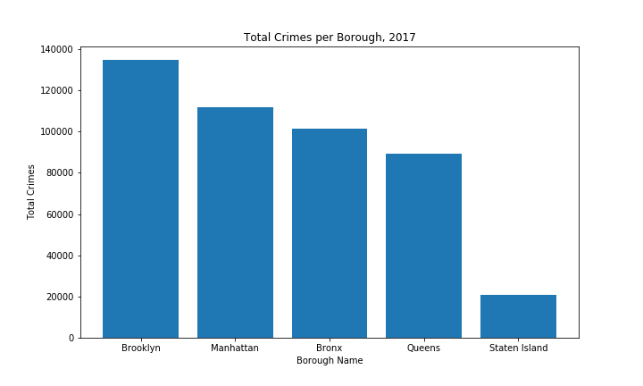

New York City is the largest city in the United States by over 8.5 million people; as such, it is natural that with
large population comes a large amount of crime. [Detailed crime data](https://data.cityofnewyork.us/Public-Safety/NYPD-Complaint-Data-Historic/qgea-i56i) exists for New York for years from 2006 to now, so we are able to gain some insight into the data.

### New York City's Crime in Numbers

Between 2006 and 2017, on average there were roughly 475,000 crimes committed per year in New York City. However, there is a general downward trend in these numbers:

In 2017, the most recent year for which we have complete data, the breakdown for crimes with valid information is as follows:

#### *458152* Total Crimes
#### *66303* Violations (the least severe category of crimes)
#### *253999* Misdemeanors (the second least severe category of crimes)
#### *137830* Felonies (the most severe category of crimes)

For some perspective on the most common types of specific crimes below, the ten most common specific crimes committed are displayed below.

The most frequently committed crime is petit larceny (a misdemeanor), which in New York is defined to be theft of 
objects with monetary value of $1000 or less. Only one violation is on the top ten: second degree harassment. This is a general crime that encompasses other specific types of infractions all under the general mantle to "alarm or annoy another person". 

Two types of assaults appear in the top ten. 3rd degree assault is a misdemeanor, and includes lesser injuries such as causing
black eyes or bruises. Felony assault is, as is implied by the category, more severe in scope. The remaining felonies in the
top ten involve "standard" crimes such as drug use, burglary, and robbery.

### Periodic Crime Patterns
Further trends reveal themselves when examining crime on a monthly, daily, and hourly basis.

As can be seen, crime is at its highest in the warmer months of the year (April through October), and decreases in the winter.

Crime reaches its peak in the afternoon and evening. As time passes late into the night and early in the morning, 
the amount of crimes decreases to a low at around 5-6 AM. The proportions of the different categories of crimes remain
roughly the same across hours; however, there are relatively less violations late in the night. This alludes to a rough
correlation between the hour of the day and the severity of the crime; a crime committed late at night is more likely
to be violent or more severe in nature compared to one during the day.

Peak crime for the city occurs on weekdays in the afternoons. On weekdays, crime is much lower in the mornings compared to 
afternoons. However, it can be seen that these patterns shift over the weekends. While the amount of crime on weekends never
quite reaches the high peaks of weekdays, the daily peaks are reached later in the night. The heightened frequency of crime
continues until 4 AM on Saturday and Sunday morning, coinciding with when the nightlife would generally be reaching its peak.

### Geographic Data and Maps

New York City is comprised of five administrative regions called boroughs. As the NYC data also contains information about
the locations of the crimes, it lends itself to analysis of geographic patterns that manifest themselves. 

For 2017, Brooklyn has the most crimes by a margin of over 20,000, which is roughly the difference between the middle three
boroughs. Staten Island has the least by far. Naturally, it's important to take population and size of the boroughs into 
account when taking pure crime numbers into account. For context, the population for New York City's zip codes are displayed
below:

<iframe src="https://thibauldbraet.github.io/maps/crime/pop_map.html" width="100%" height="400px"></iframe>

For 2017 the US Census Population estimates were as follows:

| Borough       | Population |
|---------------|------------|
| Brooklyn      | 2,648,771  |
| Queens        | 2,358,582  |
| Manhattan     | 1,664,727  |
| Bronx         | 1,471,160  |
| Staten Island | 479,458    |

Brookyln and Queens are by far the largest boroughs, which can also be seen on the map. The border between Brooklyn and Queens
is surrounded by a lot of the highest-population zip codes. Manhattan has a lot of very small neighborhoods, but they're very
densely packed. Staten Island is on the other end of the spectrum; it has around 1 million fewer inhabitants than the next smallest
borough, and its the least dense by far as well. The pure crime counts also allow us to gain a sense of the general crime
landscape of the city.

<iframe src="https://thibauldbraet.github.io/maps/crime/crime_counts.html" width="100%" height="400px"></iframe>

The crime count map is very similar to the population map, as would be expected. Noticeably, the Bronx seems to have higher crime
numbers relative to Brookyln when compared to its population. Examining the ratio between crime counts and population allows for
greater insight into the true relative prevalence of crime. 

To determine the relative crime rate, a metric was used with slight modifications. There are some zipcodes with very low populations,
which would skew the ratio. As such, a cap is placed on how high the ratio can be. The values are also rescaled to be between 0 and 1,
for use with our overall metric:

<iframe src="https://thibauldbraet.github.io/maps/crime/crime_rates.html" width="100%" height="400px"></iframe>

As can be seen, the Bronx does indeed have a very high amount of crime compared to Brooklyn and Queens after taking population into
account. Manhattan also has high crime rates. As the heart of tourism of the city, this makes sense; increased tourist flow in the
region would result in higher crime counts relative to the amount of people that actually reside in the region. 
