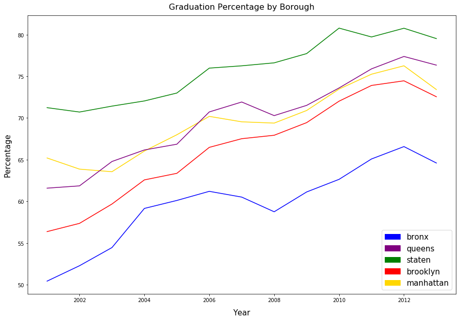
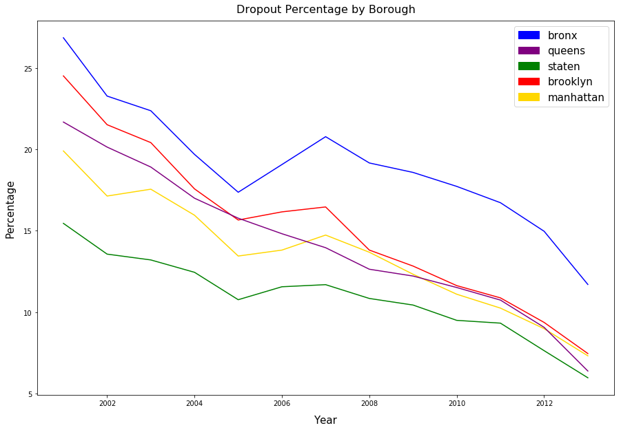

When looking at the quality of a school, an undeniably universal standard is 
the graduation and dropout rates of a school. With this in mind, we examine
these rates among the schools of NYC. In doing so, we make it possible to find
particular problem areas as well as areas in which it would be particularly easy
to raise a child with a good education.

### Trends by Borough
To begin our analysis of education, we'll examine NYC at the level of its
boroughs. Our two primary metrics for this purpose will be the graduation and
dropout rates in percent. It's important to note that, as some students take
more or fewer years in school, the two metrics
rarelyy add up to 100% and serve as independently useful standards of education 
quality.

Below, we see two graphs tracking the graduation and dropout rates between boroughs:

Interestingly, there is a definite trend towards improvement in all boroughs.
Efforts to improve education in NYC have had a serious effect on student
success. 

Beyond this, it's interesting to note how relative success between boroughs has
gone almost entirely unchanged over ten years. The Bronx has had a consistently
lower graduation rate and a higher dropout rate. Meanwhile, Staten Island has
consistently performed better than the other boroughs. This suggests that, while
pushing to improve education has a tangible benefit, it doesn't solve the
underlying problems that often cause students to fail out of schools: poverty
and other extenuating circumstances that can shape lives.

### Trends by Postcode
Next, we'll examine NYC education by postalcode to get a more detailed view of
how each borough has developed. Below, we mapped the average graduation and 
dropout rates for each postcode in the year 2013:

Graduation % by Postcode:

<iframe src="https://thibauldbraet.github.io/maps/education/grad_postcodes.html" width="100%" height="400px"></iframe>

Dropout % by Postcode:

<iframe src="https://thibauldbraet.github.io/maps/education/drop_postcodes.html" width="100%" height="400px"></iframe>

<iframe src="https://thibauldbraet.github.io/maps/education/grad_postcodes.html" width="100%" height="400px"></iframe>

Immediately, we notice that education varies drastically even within boroughs.
In many cases, neighboring postcodes have sizably different results. This
goes to show that, when judging education at this level, it's best to keep in
mind that individual schools can easily serve as outliers. Despite the presence
of these slight outliers, the map does certainly correspond to the above plots.  

In the Bronx, for instance, the average postcode has a signicantly lower
graduation rate than each of the other boroughs. 

One of the most interesting results of this analysis is the ability to see the
clarity with which income correlates to education. Staten Island, the richest
borough, has a higher graduation rate than even Manhattan - also considered a
wealthy area.
